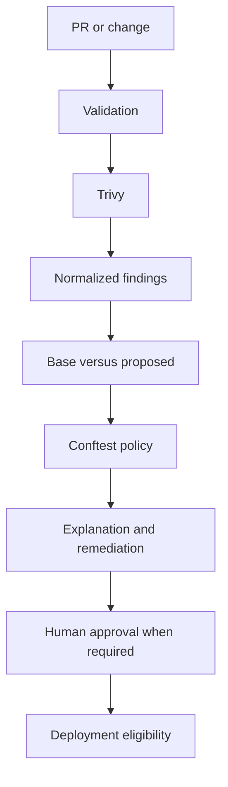

# DevSecOps security control plane

## Purpose

DevSecOps in this platform is a deployment decision stage, not a scanner next
to deployment. It answers what a change introduced, why it matters, what
policy permits, and whether the change can proceed.



`ProjectAnalyzer` remains a fast, deterministic structural assessment. It
does not start heavyweight scanners. The `security` workflow adds tool-backed
evidence immediately before future deployment eligibility.

## Tools and boundaries

Trivy is the sole scanner in this milestone. It covers filesystem dependency
vulnerabilities, secrets, Terraform and Dockerfile configuration, and an
optional already-built image. This keeps overlap and scanner maintenance low.

Conftest evaluates the Rego policy in `policy/security/`. It is not a second
scanner. `SecurityScannerTool` invokes only allow-listed Trivy arguments and
`PolicyTool` invokes only Conftest policy evaluation. Both use `ToolService`.
They are SAFE operations because they are read-only; that operational risk is
separate from the policy gate that can still return `BLOCK`.

Run a capability check before scanning:

```bash
devops-learn security doctor
```

## Evidence, normalization, and redaction

Trivy JSON is normalized into scanner-independent `SecurityFinding` values.
The domain carries stable identity, severity, category, file/package/resource,
versions, safe evidence, and change status. It never carries a raw secret
match. Before scanner output reaches a normalized finding, console text,
report, or audit event, secret-bearing fields are replaced with
`[REDACTED SECRET]`. Raw Trivy output is not persisted.

The JSON report is written to `artifacts/security/security-report.json` below
the scan target and is ignored by Git. It contains normalized evidence, policy
result, scanner metadata, and base ref only.

## Change-aware security

Use an explicit Git base ref:

```bash
devops-learn security scan projects/api_platform --base-ref origin/main
```

The scanner resolves the target repository, archives the base commit into a
temporary directory, scans that isolated state, then scans the current target.
It never checks out or alters the working tree. A SHA-256 fingerprint over
category, rule ID, target, location, resource, and installed version provides
stable comparison identity. Findings are `INTRODUCED`, `RESOLVED`,
`UNCHANGED`, or `UNCERTAIN`; duplicate identity collisions are deliberately
uncertain. Rename and dependency-version edge cases remain limitations.

Without `--base-ref`, findings are `UNCERTAIN`, so the workflow does not claim
they were introduced by the current change.

## Policy and eligibility

The default policy is inspectable in `policy/security/devsecops.rego`.

| Evidence | Default decision |
| --- | --- |
| Introduced critical issue or secret | BLOCK |
| Introduced public SSH/RDP exposure or privileged Kubernetes workload | BLOCK |
| Introduced high IaC or dependency issue | REQUIRE_APPROVAL |
| Introduced medium or uncertain high severity issue | WARN |
| Existing debt or resolved finding | Reported, not automatically blocking |

`BLOCK` makes `devops-learn security scan` exit non-zero. Deployment eligibility
also requires validation success and, for `REQUIRE_APPROVAL`, a recorded human
approval. There is no `--ignore-security` flag and the AI cannot waive policy.
Any future override must be explicit, reasoned, scoped to a fingerprint, and
audited; it is intentionally not implemented yet.

## Explanation and remediation

The explanation service uses the existing execution mode and explanation depth.
It renders what was found, why it matters, policy result, safe evidence, and a
remediation classification. Scanner evidence and Rego remain truth; an LLM may
explain but cannot invent a finding, claim a rescan, or overrule policy.

Credential removal/rotation is `HIGH_RISK`; network and identity changes need
human input; dependency and IaC corrections require review. No high-risk
infrastructure change is auto-remediated.

## Demo

The demo is deliberately isolated under `projects/devsecops_demo/` and uses a
synthetic value that cannot authenticate anywhere. It is not a deployable
application. The following creates an ephemeral Git repository so the current
insecure state is compared to a real base:

```bash
demo_dir=$(mktemp -d)
cp -R projects/devsecops_demo/baseline "$demo_dir/demo"
git -C "$demo_dir/demo" init
git -C "$demo_dir/demo" config user.email demo@example.invalid
git -C "$demo_dir/demo" config user.name devsecops-demo
git -C "$demo_dir/demo" add .
git -C "$demo_dir/demo" commit -m baseline
cp -R projects/devsecops_demo/proposed/. "$demo_dir/demo/"
devops-learn security scan "$demo_dir/demo" --base-ref HEAD
cp -R projects/devsecops_demo/remediated/. "$demo_dir/demo/"
devops-learn security scan "$demo_dir/demo" --base-ref HEAD
```

The first command is expected to block once Trivy detects the synthetic secret
and configuration findings. The second is expected to be non-blocking. Scanner
rule IDs and Dockerfile findings can vary by Trivy release, so the demo’s
policy proof is based on the detected secret and public administrative ingress.

## CI and future Azure path

Pull-request CI installs Trivy and Conftest, runs a base-aware security scan of
the bundled real FastAPI project, uploads the sanitized report, and never uses
Azure credentials or runs `terraform apply`. GitHub PR metadata supplies the
base SHA, not `HEAD~1`.

The real-only `deploy` path composes Terraform fmt, validate and saved plan,
plan JSON risk analysis, Trivy filesystem/config/image evidence, normalized
change-aware findings, Conftest policy, deployment eligibility, human approval,
candidate-bound real apply, Azure observation, and health verification. It is
not marked live-verified until an opt-in Azure run succeeds.

## Limitations

Image scanning requires a locally built image and Docker availability. The
first comparison implementation does not solve every move, rename, or package
upgrade equivalence. Policy overrides, real Terraform plan scanning, Azure
apply, runtime detection, and Kubernetes deployment are intentionally out of
scope.
